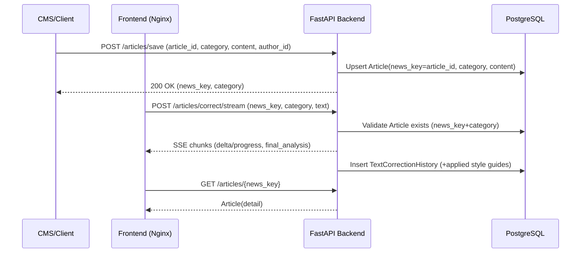

# Korea Times AI Styler

빠르게 기사 번역/교정(스타일 적용)을 제공하는 풀스택 프로젝트입니다.

## 빠른 시작 (개발 환경)

1. 환경변수 준비

- `.env.example`를 `.env`로 복사 후 필요한 값들을 채웁니다.

2. 컨테이너 실행

- `docker compose up -d --build`
- 서비스 포트
  - Frontend: `http://localhost:${FRONTEND_PORT:-80}` (기본 80)
  - Backend: `http://localhost:${BACKEND_PORT:-8080}` (기본 8080)

3. 스타일가이드 자동 시드

- 루트의 `style_guides.json`이 컨테이너 내부 `/app/seed/style_guides.json`으로 마운트되며,
  `STYLE_GUIDES_FILE=/app/seed/style_guides.json`이 설정되어 있으면 최초 1회 자동 시드됩니다.
- 테이블이 비어있을 때만 시드되며, 이후에는 시드를 건너뜁니다.

## 운영(프로덕션) 실행

yml 파일: `docker-compose.prod.yml`.

- .env 주요 항목

  - `DATABASE_URL=postgresql+asyncpg://<USER>:<PASSWORD>@<RDS_ENDPOINT>:5432/<DBNAME>`
  - `POSTGRES_HOST=<RDS_ENDPOINT>` (entrypoint의 DB 대기용)
  - `POSTGRES_PORT=5432`, `POSTGRES_DB=<DBNAME>`, `POSTGRES_USER=<USER>`, `POSTGRES_PASSWORD=<PASSWORD>`
  - `POSTGRES_SSLMODE=require` (RDS 권장)
  - `STYLE_GUIDES_FILE=/app/seed/style_guides.json` (최초 시드 원할 때)

- 실행

  - `docker compose -f docker-compose.prod.yml up -d --build`

- 프론트엔드 환경
  - 프론트는 상대경로(`/articles`, `/auth` 등)로 요청하고 Nginx가 `backend:8080`으로 프록시합니다.

## 필수 플로우: 기사 저장 후 교정/번역 시작

AI 교정/번역을 시작하기 전에 반드시 기사 저장 API(`/articles/save`)로 DB에 기사를 저장하는 것을 권장합니다.
코드 레벨에서도 이를 강제합니다. 저장되지 않은 `news_key + category`로 교정을 요청하면 400 오류를 반환합니다.

1. 기사 저장 (CMS → Backend)

```bash
curl -X POST http://localhost:8080/articles/save \
  -H "Content-Type: application/json" \
  -d '{
    "article_id": "KT-2025-0001",           # news_key로 저장됨
    "category": "articles_translator",      # headlines/articles/captions/articles_translator/seo
    "content": "원문 혹은 초기 텍스트...",
    "author_id": "cms-user-1"
  }'
```

응답 예시:

```json
{
  "article_id": "KT-2025-0001",
  "news_key": "KT-2025-0001",
  "category": "article"
}
```

2. 프론트엔드에서 기사 열기 후 교정/번역 시작

- 브라우저에서 프런트 UI 접속: `http://localhost`
- UI에서 해당 기사(news_key)에 대해 교정/번역을 시작하면, 백엔드의 스트리밍 API를 호출합니다.

수동 호출 예시(교정 스트림):

```bash
curl -N -X POST http://localhost:8080/articles/correct/stream \
  -H "Content-Type: application/json" \
  -d '{
    "news_key": "KT-2025-0001",
    "category": "articles",           # title/articles/captions/seo 등 지원(대소문자 무관)
    "text": "교정/번역 대상 텍스트",
    "prompt": null
  }'
```

## 시퀀스 다이어그램



## 참고 사항

- 저장 선행 검증

  - `POST /articles/correct/stream`, `POST /articles/correct/openai-stream` 호출 시,
    `news_key`가 `local-`로 시작하지 않는다면 DB에 해당 Article이 존재해야 합니다.
    없으면 400을 반환합니다.

- 스타일가이드 시드

  - 컨테이너 부팅 시: Alembic 적용 후 style_guides 테이블이 비어있으면 1회 시드합니다.
  - 앱 시작 시: 테이블이 비어있을 때만 1회 시도합니다.
